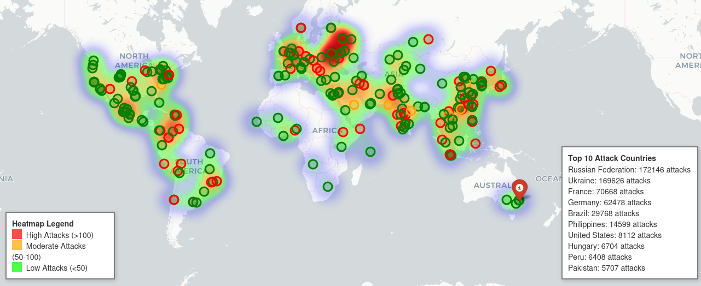
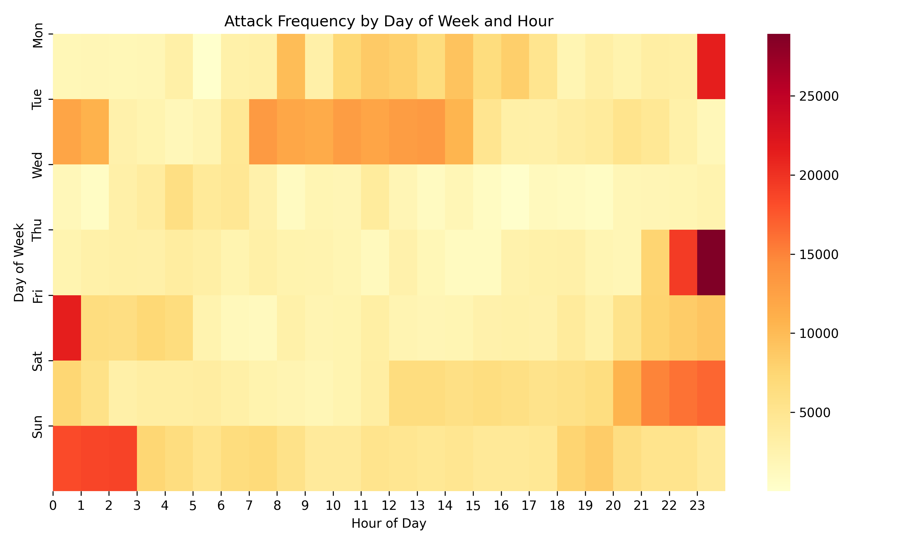

# What Happens When You Leave RDP Open for 40+ Days?

Every day, infostealers, botnets, and initial access brokers scan the internet looking for vulnerable targets. Devices with exposed services — especially RDP — are high-value targets.

This project explores what happens when a Windows system with RDP enabled is passively monitored after being left exposed to the internet for ~44 days. It visualizes the results, summarizes attacker behavior, and provides a repeatable analysis pipeline.

The results? Nearly 900,000 brute-force attempts, from over 600 unique IP addresses spanning 70+ countries.

---

## 📊 Key Stats

**Observation Window**  
- Start Time: 2025-06-04 03:43:57  
- End Time: 2025-07-18 06:08:08  
- Duration: 44 days, 2 hours, 24 minutes

**Brute Force Summary**  
- Total failed login attempts: 891,715  
- Unique attacking IPs: 609  
- Unique usernames used: 64,351  
- Unique countries observed: 71  

---

## 🔍 Key Findings

Over the 44-day observation period, the exposed RDP endpoint was relentlessly targeted by opportunistic brute-force attempts. The findings below reflect patterns observed from the normalized and geolocated logs — with insights drawn from both geographic and behavioral data.

(Full disclosure: I'm still new to GeoIP lookups, and while this may not be the fanciest approach, it was fast, simple, and got the job done for this project.)

### 🌍 Attacker Origins (GeoIP)

  
*A global heatmap of brute-force origins — view the full interactive version in [`visualizations/attack_map_final.html`](visualizations/attack_map_final.html)*

Out of 891,715 total brute-force attempts, **586,916** (65.8%) could be successfully geolocated using the GeoLiteCity database.  
The remaining ~305,000 attempts involved private, reserved, or unresolvable IPs. Yes, there are newer GeoIP options - but for this project, the legacy GeoLiteCity got me close enough, fast. 

Among the **geolocated** attempts, the **top 10 countries** accounted for **93.07%** of activity — showing a clear concentration of attacks from a small number of regions:

| Country               | Count    | Percent |
|------------------------|---------:|--------:|
| 🇷🇺 Russian Federation | 172,146 | 29.33% |
| 🇺🇦 Ukraine           | 169,626 | 28.90% |
| 🇫🇷 France            | 70,668  | 12.04% |
| 🇩🇪 Germany           | 62,478  | 10.65% |
| 🇧🇷 Brazil            | 29,768  |  5.07% |
| 🇵🇭 Philippines       | 14,599  |  2.49% |
| 🇺🇸 United States     | 8,112   |  1.38% |
| 🇭🇺 Hungary           | 6,704   |  1.14% |
| 🇵🇪 Peru              | 6,408   |  1.09% |
| 🇵🇰 Pakistan          | 5,707   |  0.97% |

📊 Total attacks from top 10: 546,216  
📦 Total attacks (geolocated): 586,916  

> ⚠️ *Note: This breakdown only includes IPs that could be geolocated. It represents ~66% of the total dataset.*

---
### ⏱️ Temporal Trends

  
*Login attempts by hour of day and day of week — darker = more attacks*

- Attacks occurred **around the clock**, with no real “safe” window.
- The **most active hours** were between **10:00 and 18:00 UTC**, suggesting automation or attacker infrastructure aligned to European/Central Asian time zones.
- Activity persisted through weekends, reinforcing that most attacks are automated and persistent.

---

## 🌍 Overview

This repository presents a real-world security research project analyzing brute force login activity targeting an exposed Windows RDP service. Over a 44-day observation window, Windows Security Event Logs were collected and analyzed to uncover:

- The volume and frequency of failed login attempts.
- Geographic distribution of attacking IPs.
- Patterns in username selection by attackers.
- Temporal trends in attack behavior (by hour and weekday).

Using interactive visualizations and real attacker data, this project aims to raise awareness of the risks of exposing RDP to the public internet — particularly in environments where:
- Default credentials are used,
- Services are misconfigured or accidentally left open, or
- RDP is enabled by third parties (e.g., MSPs) without sufficient hardening or monitoring (Don't enable RDP!).

The findings demonstrate how automated and opportunistic these attacks are. Common usernames used in the spray patterns (e.g., admin, test, user, scan, backup, etc.) highlight that attackers are not targeting specific individuals — they’re casting a wide net and waiting for weak configurations to give them access. Don’t let a weak config turn into your own Colonial Pipeline moment!

The data also shows clear trends in when attacks occur — suggesting attacker infrastructure may be tied to specific time zones or automated tooling windows.

While care has been taken to cleanse and validate the data, this is a research project and some figures may be subject to minor inaccuracy due to the automated nature of processing and geolocation limitations. All findings are provided in good faith to support community learning and awareness.

---

## 🔧 How It Works (The Analysis Pipeline)

### 1. Data Collection  
Windows Security Event Logs (EVTX format) were collected from a system exposed to the internet with RDP enabled. Events with ID **4625** (failed logon) were extracted for analysis.  
To parse and normalize this data [`Process-EventLogs`](https://github.com/mark-hallman/Process-EventLogs) utility was used to convert the logs into a structured CSV.

### 2. Data Normalization  
The resulting CSV was filtered to extract key fields of interest:
- Timestamp of the login attempt
- IP address of the attacker
- Username attempted
- Hostname (if available)

### 3. IP Geolocation  
Each IP address was geolocated using the legacy GeoLiteCity.dat database from MaxMind.
While this database is no longer actively maintained, it provided sufficient accuracy for high-level country and city mapping in the context of this research.

### 4. Visualization  
The main script (`brute-force-analysis.py`) generates:

- **An interactive world map** showing the origin of login attempts.  
  - Markers are color-coded by attack volume (red = high).  
  - Clicking reveals country-level and city-level details — including local and total attack counts.

- **A heatmap by day and hour** to visualize attack timing.  
  - This helps reveal which time zones or infrastructure are behind the activity, or when attackers are most active.

Getting something visually clear (and decent-looking) took a surprising amount of tweaking — it’s not perfect, but it’s a lot better than where it started. Hopefully it helps tell the story in a more intuitive way.

### 5. IOC Extraction  
A cleaned set of Indicators of Compromise (IOCs) was extracted from the dataset, including:
- Attacking IP addresses
- Usernames used in brute force attempts
- Hostnames observed in the event logs

These are available in the `IOCs/` folder for reference.  

⚠️ Note: For privacy and operational security, hostnames that may reference internal devices or domain structures have been removed. The remaining IOCs still reflect meaningful attacker behavior and patterns, while protecting sensitive information. Raw event logs are **not** included in this repository.

---

## ⚠️ Disclaimer

This project is based on log data collected from a Windows system that was exposed to the internet and monitored for research purposes.  
No systems were compromised in the making of this analysis, and no sensitive data is shared.

The goal of this project is to raise awareness about the risks of exposing services like RDP to the public internet.  
All analysis was performed passively using standard event logs and geolocation tools.

This repository is for educational use only.

👉 If you're running exposed services — especially RDP — consider this your cautionary tale.
Harden your perimeter, monitor logs, and never assume you're too small to be a target.

---

## 📁 File Structure

```
.
├── IOCs/                   # Extracted IPs, usernames, hostnames (no raw logs)
│   ├── ips.txt
│   ├── usernames.txt
│   └── hostnames.txt
├── visualizations/         # Output visualizations (e.g. heatmaps, world map)
│   ├── attack_map_final.html
│   └── time_heatmap.png
├── brute-force-analysis.py # The main analysis script
├── generate_findings_stats.py  # Script to calculate top attacking countries
├── GeoLiteCity.dat         # GeoIP database used for mapping
└── README.md
```
